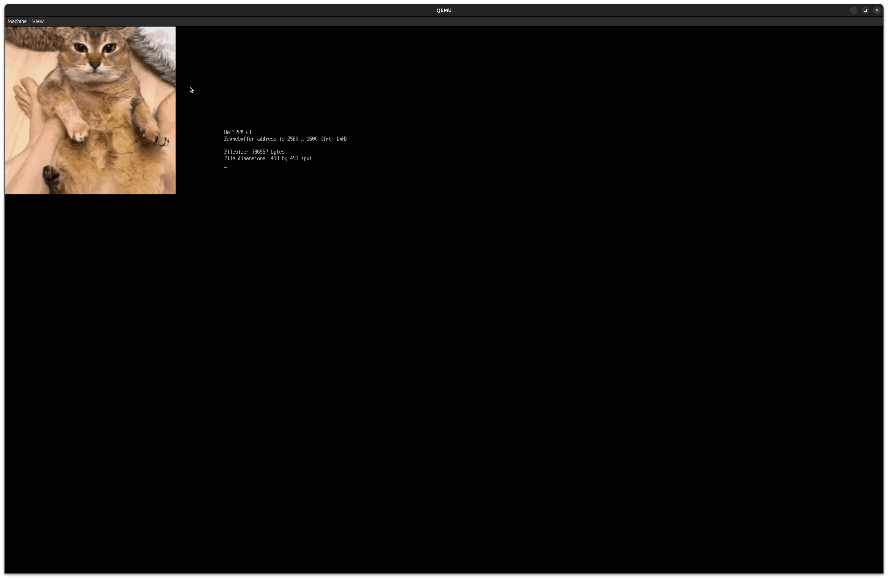

# UefiPPM
A small (>125 LoC!), bare metal, [PPM v6](https://netpbm.sourceforge.net/doc/ppm.html) parser as a UEFI app. It sets up the biggest framebuffer it can, to be able to display
as big of an image as possible. Unfortunately, this does not allow for *all* images
to be displayed.

On QEMU, the app cannot display any images bigger than 2560 x 1600 pixels (4,096,000
pixels).

# Screenshot(s)


# Using UefiPPM in your project
You don't need a UEFI environment to use UefiPPM. All you need:
- `FILE*`, `fopen`/`fclose`
- `malloc`/`free`
- A working printf implementation (`%ld`, `%s`, `%d`, etc.)
    - By extension `fprintf`
- Some `putpixel` implementation that uses
    - The framebuffer's VRam address
    - Framebuffer's pixels per scanline

Note that some code for UefiPPM will hang the system (the `for(;;);` bits).
This is because, in the UEFI environment, returning from the UEFI app will
either:
1. Go back to the UEFI firmware
2. Try and find another OS to boot (if it can't it'll go to 1)

This'll make the error message not appear to the user. So, we hang the system.
You may want to change the code to not do this, depending on the environment

## Taking the code
From line 61 to 153 is environment-agnostic code, as long as you have the stuff
mentioned earlier, meaning you can use this in most environments.

## Crediting
Please credit me/link to this repo (since, you know, I developed UefiPPM)
in your source code. Thanks:)

# How to use
## Installing POSIX-UEFI
```sh
$ git clone https://gitlab.com/bztsrc/posix-uefi.git
$ cd uefippm/src
$ ln -sf ../../posix-uefi/uefi
```

## Adding your image
Just overwrite `src/image.ppm` with your PPM image.

## Running
```
$ make
...
$ make qemu
```

Or, if you want to boot off of an ISO, you can just run
```
$ make && make iso
```

then flash the ISO to your USB/drive. You can then boot off of it.

# Troubleshooting
The app is meant to tell you what went wrong, for example:
> Sorry, the image is too big for the framebuffer we set up.

or
> This EFI application only runs on PPM v6. Please make sure the image you load uses PPM v6.

This is so you don't have to guess on what's going on.

# TODO
1. Optimize width/height detection code.
