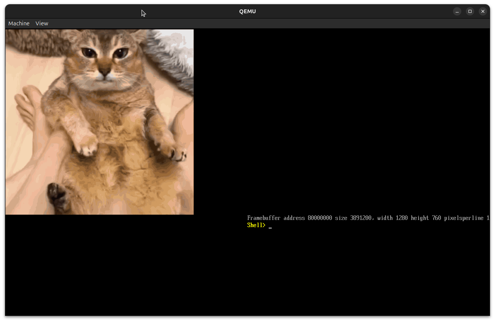

# UefiPPM
A small, bare metal, [PPM v6](https://netpbm.sourceforge.net/doc/ppm.html) parser as a UEFI app.

# Screenshot


# How to use
## Installing POSIX-UEFI
```sh
$ git clone https://gitlab.com/bztsrc/posix-uefi.git
$ cd uefippm/src
$ ln -sf ../../posix-uefi/uefi
```

## Adding your image
Just overwrite `src/image.ppm` with your PPM image. Make sure it is version 6. I have not coded any logic for
```
width > 999
height > 999
```

so, for now, make sure your image is smaller than that

## Running
```
$ make
...
$ make qemu
```

Or, if you want to boot off of an ISO, you can just run
```
$ make && make iso
```

then flash the ISO to your USB/drive. You can then boot off of it.

# TODO
1. Support images larger than `999x999`.
2. Fix any bugs
3. Support earlier versions of PPM (if possible)
